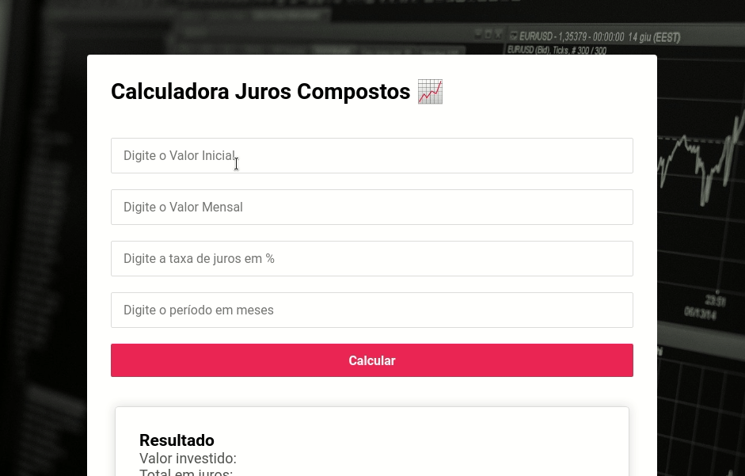

# Sobre o projeto

### Calculadora de Juros Compostos com aporte mensal

[](https://github.com/gabrielcastroo/calculadora-juros-compostos/blob/main/LICENSE)




O projeto consiste em uma Calculadora de Juros Compostos, criada para auxiliar em calculos de investimentos de renda fixa.
Chama-se renda fixa um investimento que possui uma rentabilidade previsível. Ela pode ser fixada em um percentual mensal ou seguir algum índice como a taxa Selic, o CDI ou outro.

### Tecnologias Utilizadas

O projeto utiliza as seguintes tecnologias:

1. JavaScript
2. CSS 3 (Puro)
3. HTML 5
4. Biblioteca: Google Charts

## 💻 Pré-requisitos

* Um Browser (Chrome, Firefox ...)

## 🚀 Instalando o Projeto

Para instalar, siga estas etapas:

Linux:
```bash
    # clonar repositório
    git clone https://github.com/gabrielcastroo/calculadora-juros-compostos
    # Abrir index.html
```

Windows:
```cmd
    # clonar repositório
    git clone https://github.com/gabrielcastroo/calculadora-juros-compostos
    # Abrir index.html
```

## Autor

Criado por Gabriel Castro, programador e estudante dos cursos de Bacharelado em Ciência da Computação e Técnico em Desenvolvimento de Sistemas Educacionais.

